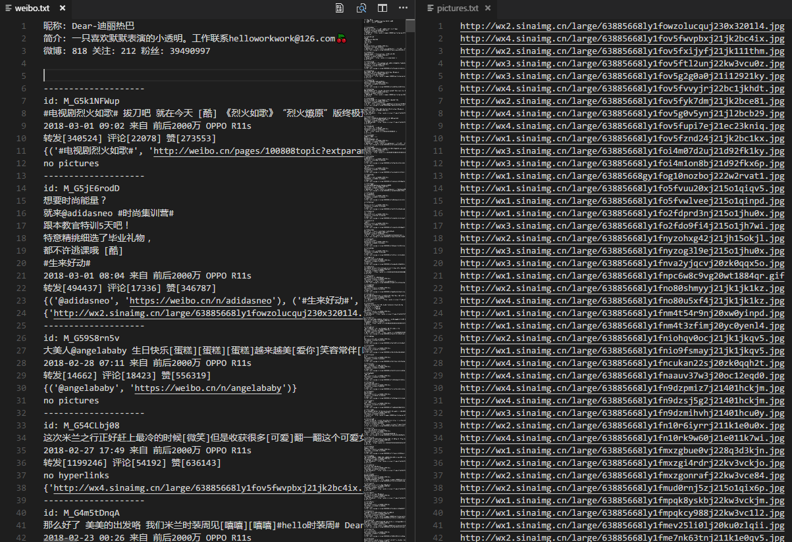

# 结果



# 输入

需要抓取的用户 id，是否抓取图片 url，以及用于登录的 cookie

# 输出

名字为用户昵称的文件夹，包含原创微博的数据及原图 url（可选）。

## weibo.txt

用户信息包括

- 昵称
- 简介
- 微博数、关注数、粉丝数

原创微博，包含

- 微博 id（可能是）
- 微博内容
- 转评赞数据
- 发布时间及来源
- 可能含有的超链接
- 可能含有的图片 url

## pictures.txt

原创微博的原图 url

# 运行环境

- Python 3.6

## 依赖

- requests
- bs4

# 使用

运行

```python
    cookies = "自己的 cookies"
    fetch_id = 1669879400 # 需要抓取的微博id
    fetch_pic = False # 是否抓取原图url
    weibo = WeiBoSpider(cookies, fetch_id， fetch_pic)
    weibo.start()
    weibo.save()
```

# 存在的问题

- 每次获取组图均需要发起一次请求，可能由于这个原因导致抓取一定图片后连接被关闭

# 参考

- [dataabc/weiboSpider](https://github.com/dataabc/weiboSpider)
